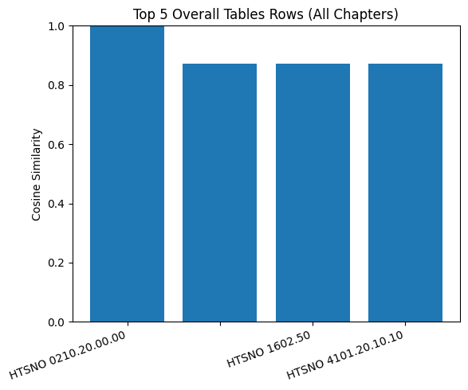
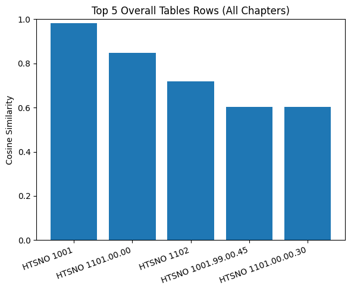
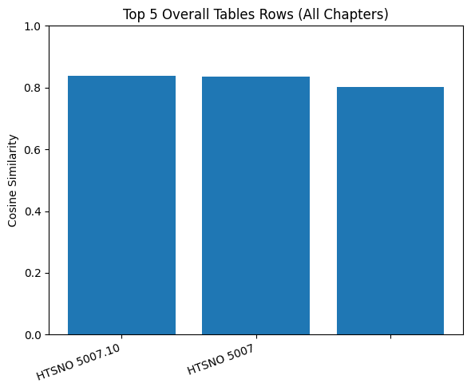
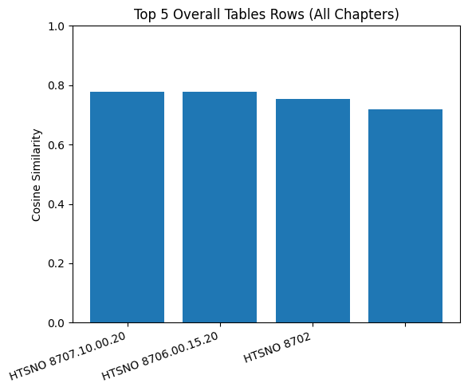
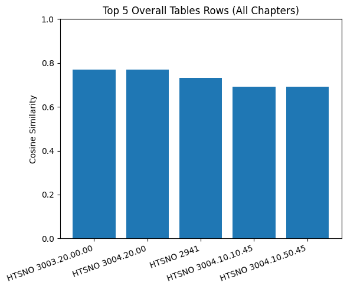
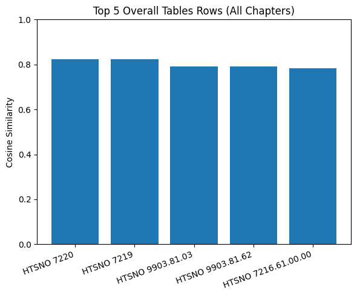
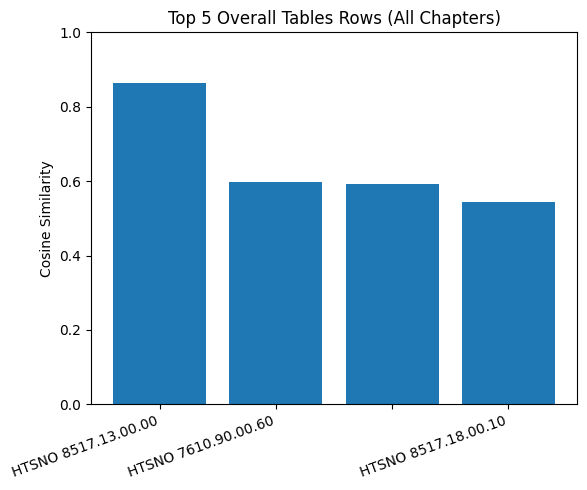
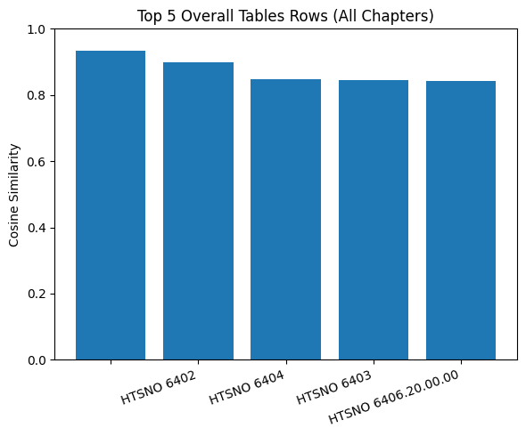
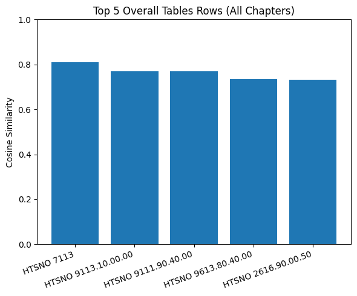
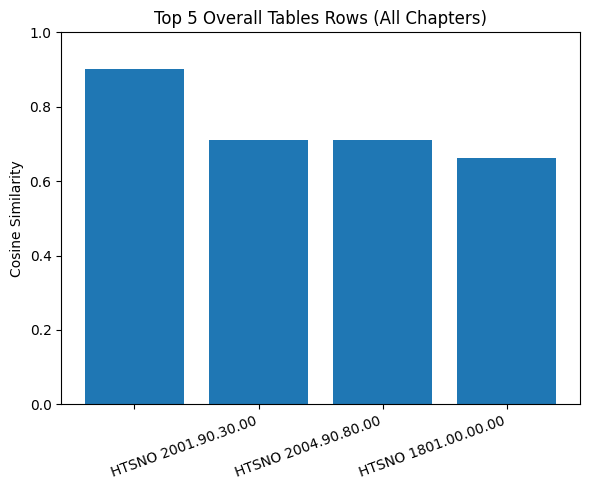

# HTS Hierarchical Similarity Graphs

## Query: Meat of bovine animals

**Global:**

---

## Query: Wheat and meslin

**Global:**

---

## Query: Silk fabrics

**Global:**

---

## Query: Passenger motor vehicles

**Global:**

---

## Query: Medicaments containing antibiotics

**Global:**

---

## Query: Flat-rolled products of stainless steel

**Global:**

---

## Query: Mobile phones

**Global:**

---

## Query: Footwear with rubber soles

**Global:**

---

## Query: Jewelry of precious metals

**Global:**

---

## Query: Coffee beans, roasted

**Global:**

---

