# HTS Table Similarity Trend Graphs

## Query: Meat of bovine animals

**Chapter Trend:**

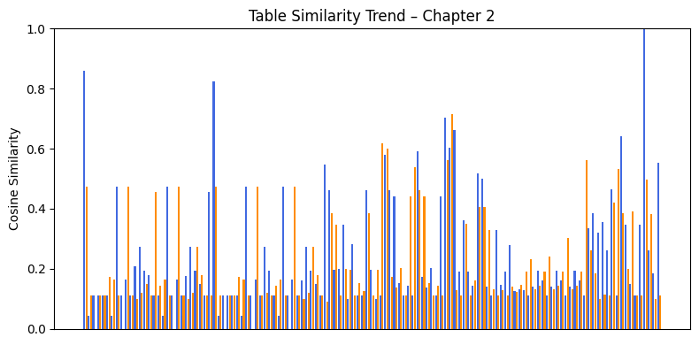

**All Chapters Trend:**

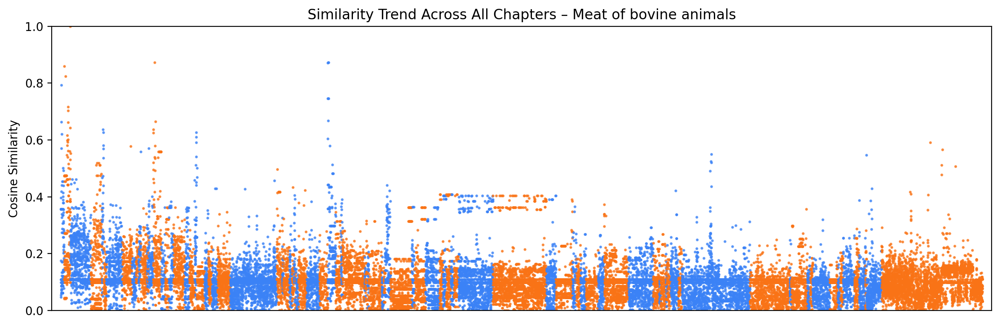

---

## Query: Wheat and meslin

**Chapter Trend:**

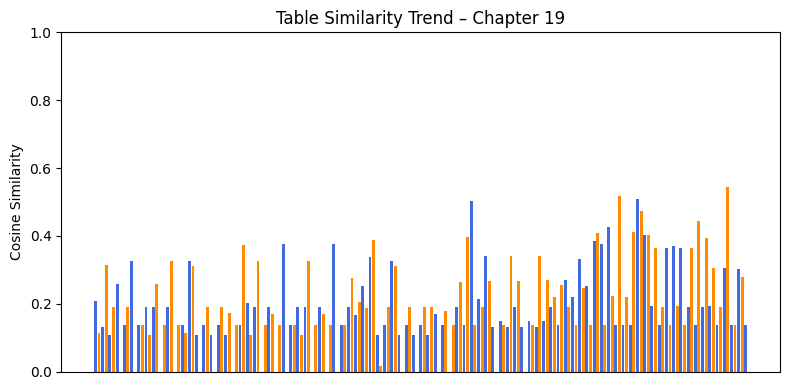

**All Chapters Trend:**

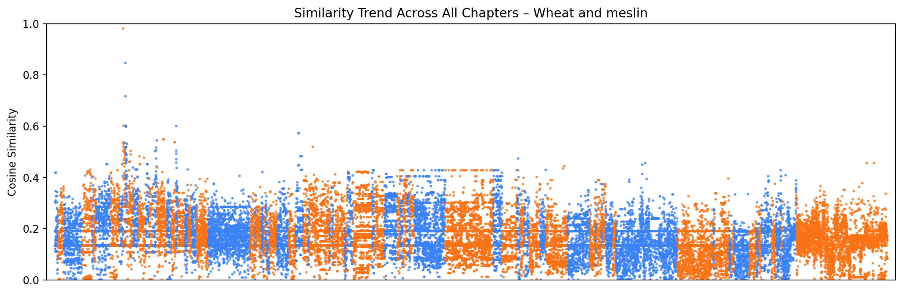

---

## Query: Silk fabrics

**Chapter Trend:**

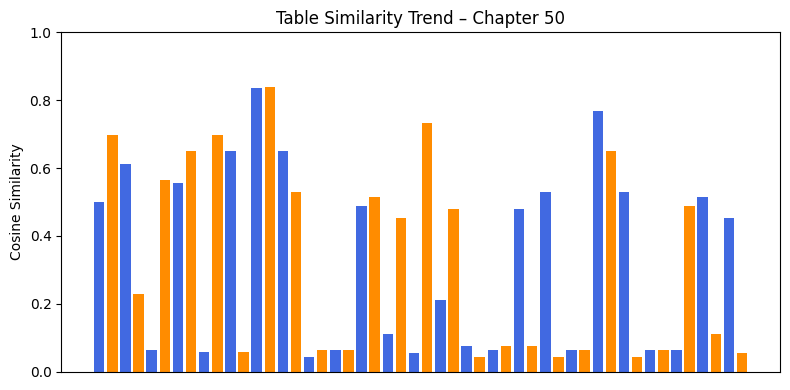

**All Chapters Trend:**

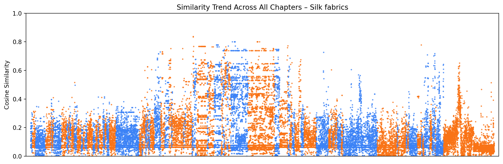

---

## Query: Passenger motor vehicles

**Chapter Trend:**

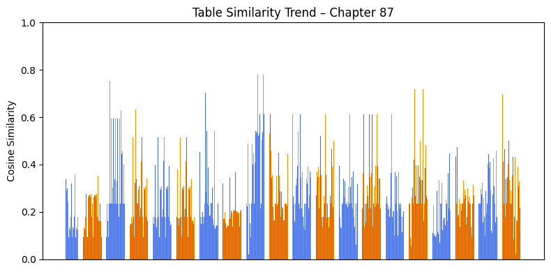

**All Chapters Trend:**

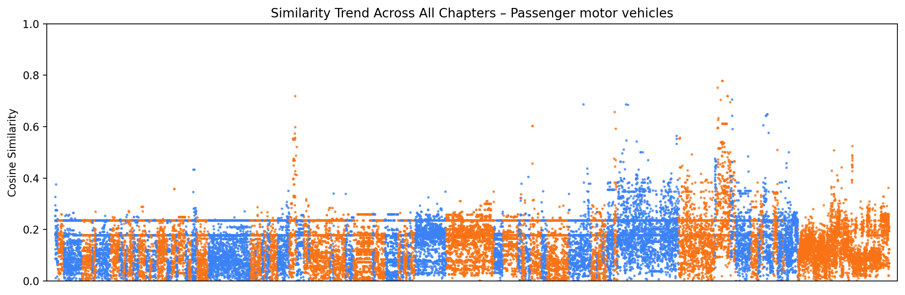

---

## Query: Medicaments containing antibiotics

**Chapter Trend:**

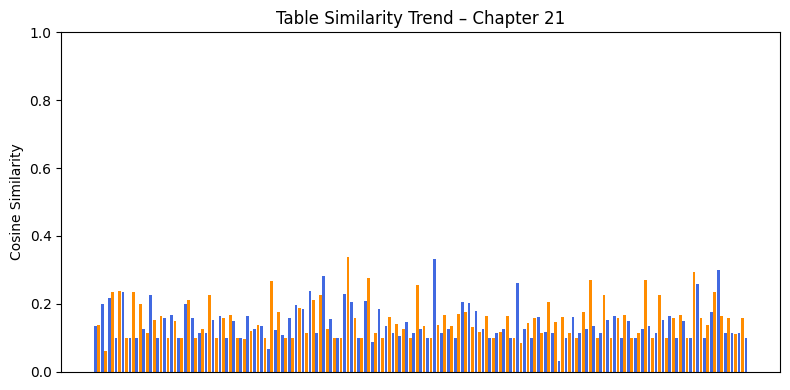

**All Chapters Trend:**

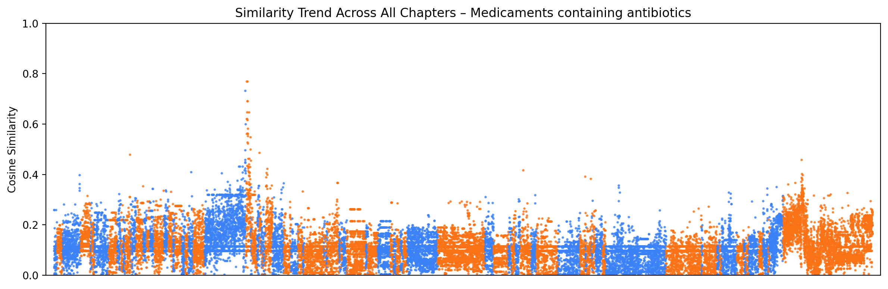

---

## Query: Flat-rolled products of stainless steel

**Chapter Trend:**

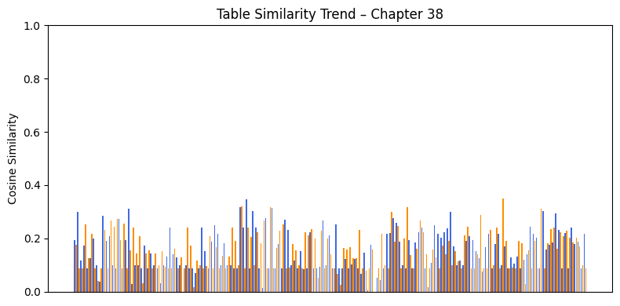

**All Chapters Trend:**

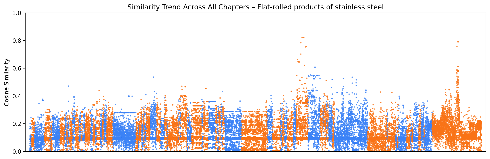

---

## Query: Mobile phones

**Chapter Trend:**

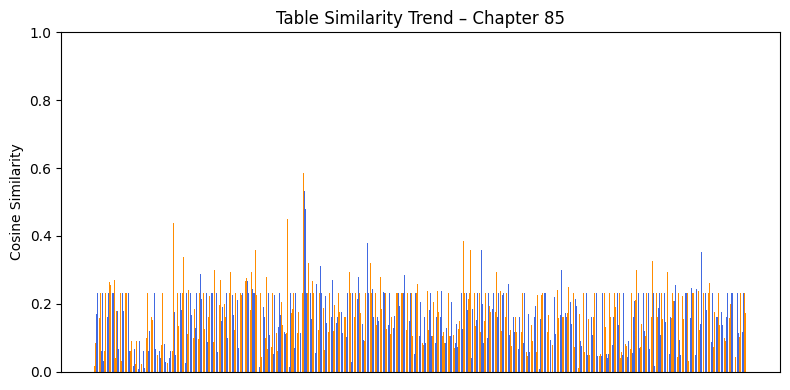

**All Chapters Trend:**

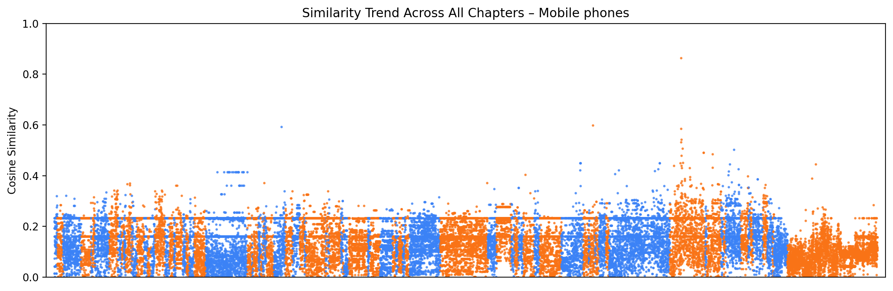

---

## Query: Footwear with rubber soles

**Chapter Trend:**

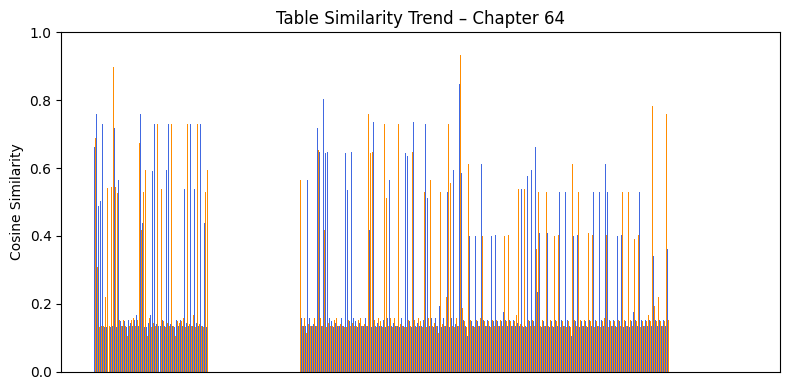

**All Chapters Trend:**

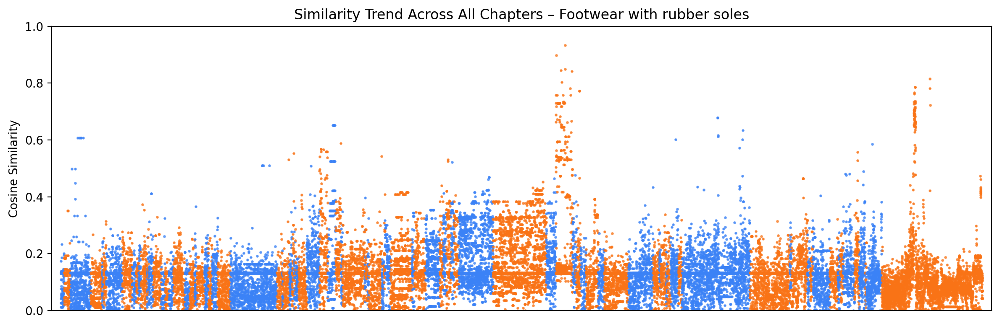

---

## Query: Jewelry of precious metals

**Chapter Trend:**

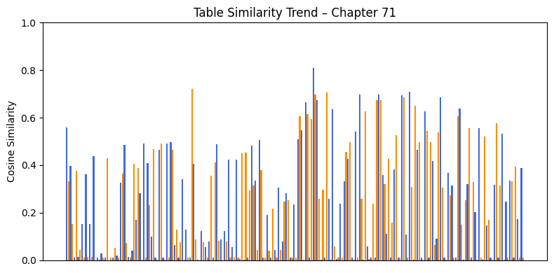

**All Chapters Trend:**

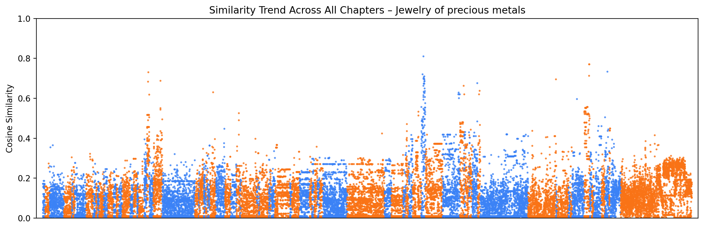

---

## Query: Coffee beans, roasted

**Chapter Trend:**

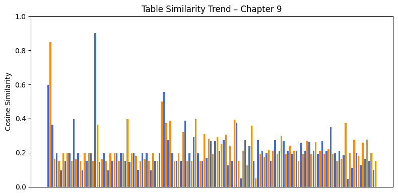

**All Chapters Trend:**

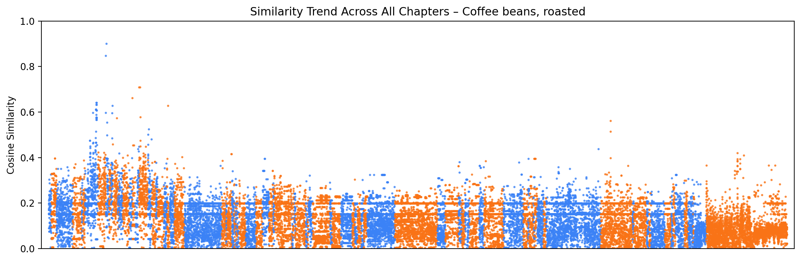

---

